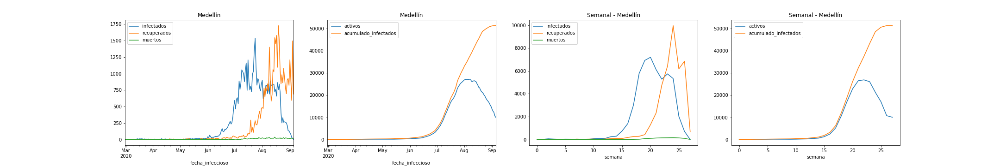

# Pronostico de la evolución de casos activos de SARS-CoV-2 en Colombia

Colombia no ha sido ajena a la crisis generada por la aparición del síndrome respiratorio agudo severo (COVID-19), enfermedad que ha llevado al limite a la sociedad debido a su impacto y a las medidas disruptivas, rigurosas y extremas que han tomado los gobiernos para controlar su transmisión, desde su reconocimiento como una pandemia mundial el 11 de marzo de 2020. Uno los principales elementos para la toma de decisiones ha sido el pronóstico y la modelación del total de casos diagnosticados, el total de casos activos, la cantidad de casos recuperados y las muertes esperadas, tanto en el corto como en el largo plazo.
En la literatura más relevante, la evolución de casos en general ha sido abordada de dos formas diferentes: la primera es mediante el uso de modelos SIR y sus variaciones (Susceptible-Infectado-Recuperado), que son básicamente modelos de simulación basados en supuestos muy fuertes sobre la evolución de la enfermedad. la segunda aproximación corresponde al uso de metodologías de pronóstico de series de tiempo (tanto estadísticas como de inteligencia artificial) para pronosticar los nuevos casos activos o los casos confirmados; sin embargo, esta aproximación también supone fuertes hipótesis sobre como se comporta la enfermedad.

# Resultados

Los resultados del proceso pueden verse en:

## Descarga

[Descarga de datos](1_Descarga de Datos.html)

## Preprocesamiento

[Preprocesamiento](2_Preprocesamiento.html)

## Modelos ciudades
---
### Bogotá

[Modelo Bogotá](3_Modelo_Bogota.html)

[Resultados Bogotá](resultados_Bogota.md)

#### Diagnóstico

---
### Medellín

[Modelo Medellín](3_Modelo_Medellin.html)

[Resultados Medellín](resultados_Medellin.md)

#### Diagnóstico

---
### Cali

[Modelo Cali](3_Modelo_Cali.html)

[Resultados Cali](resultados_Cali.md)

#### Diagnóstico

---

### Barranquilla

[Modelo Barranquilla](3_Modelo_Barranquilla.html)

[Resultados Barranquilla](resultados_Barranquilla.md)

#### Diagnóstico

---

### Cartagena

[Modelo Cartagena](3_Modelo_Cartagena.html)

[Resultados Cartagena](resultados_Cartagena.md)

#### Diagnóstico

---

